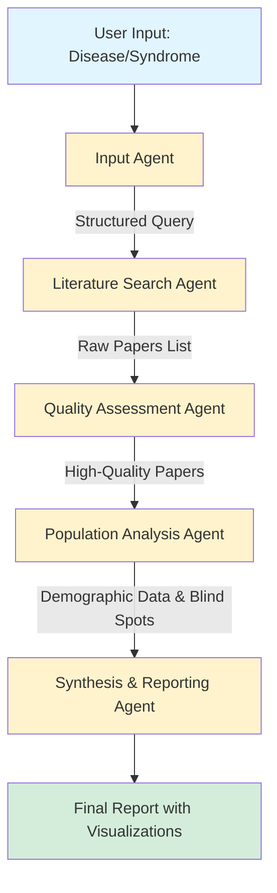

# Medical Research Blind Spot Analyzer

An intelligent multi-agent system designed to identify underrepresented populations and research gaps in medical literature for any given disease or syndrome.

## 🎯 Project Goal

Given a syndrome or disease as input, this system produces a comprehensive map of blind spots in medical research—such as studies lacking representation of people over 75, pregnant women, specific ethnic groups, or other demographic categories.

The system performs quality-controlled literature analysis by:
- Searching all relevant research papers across multiple databases
- Evaluating paper quality based on content, journal reputation, and author credentials
- Identifying demographic gaps in research populations
- Discarding low-reputation or poor-quality research

## 🏗️ Architecture Overview

The system consists of five specialized agents working in sequence, each with distinct responsibilities:



## 🤖 Agent Descriptions

### A. Input Agent

**Role:** Standardize and validate user input.

**Output:** Structured query containing disease/syndrome name and optional filters.

**Tasks:**
- Parse and normalize user input (e.g., "Alzheimer's" → "Alzheimer's disease")
- Allow optional filters such as:
  - Age ranges
  - Gender specifications
  - Comorbidities
  - Study exclusions (e.g., "exclude pediatric studies")
- Output a structured query object for downstream agents

**Example Output:**
```json
{
  "disease": "Alzheimer's disease",
  "filters": {
    "exclude_pediatric": true,
    "min_year": 2015
  }
}
```

---

### B. Literature Search Agent

**Role:** Retrieve all relevant research papers from multiple sources.

**Output:** Comprehensive list of papers with metadata (title, authors, journal, DOI, abstract, publication date).

**Tasks:**
- Query multiple academic databases:
  - PubMed
  - Google Scholar
  - arXiv
  - Other domain-specific databases
- Apply filters:
  - Publication date ranges
  - Language restrictions
  - Study type (clinical trials, meta-analyses, etc.)
- Deduplicate results across databases
- Output standardized paper list

**Example Output:**
```json
{
  "papers": [
    {
      "doi": "10.1000/example",
      "title": "Study Title",
      "authors": ["Author 1", "Author 2"],
      "journal": "Journal Name",
      "publication_date": "2023-01-15",
      "abstract": "...",
      "source": "PubMed"
    }
  ]
}
```

---

### C. Quality Assessment Agent

**Role:** Evaluate the quality and relevance of each paper, filtering out low-quality research.

**Output:** Filtered list of high-quality papers with quality scores and inclusion/exclusion rationale.

**Tasks:**

1. **Journal Reputation Assessment:**
   - Check journal impact factor
   - Verify indexing (SCI, Scopus)
   - Review retraction history
   - Identify predatory journals

2. **Author Reputation Assessment:**
   - Calculate author h-index
   - Verify institutional affiliations
   - Check for past retractions
   - Identify conflicts of interest

3. **Content Quality Assessment:**
   - Evaluate study design (RCT, observational, case study)
   - Assess sample size adequacy
   - Review statistical rigor
   - Measure relevance to query

4. **Filtering:**
   - Discard papers from predatory journals
   - Remove non-peer-reviewed publications
   - Exclude studies with critically low sample sizes
   - Filter out low-relevance papers

**Example Output:**
```json
{
  "high_quality_papers": [
    {
      "doi": "10.1000/example",
      "quality_score": 8.5,
      "journal_score": 9.2,
      "author_score": 8.0,
      "content_score": 8.3,
      "inclusion_reason": "High-impact journal, rigorous RCT design, adequate sample size",
      "flags": []
    }
  ],
  "excluded_papers": [
    {
      "doi": "10.2000/excluded",
      "exclusion_reason": "Predatory journal, no peer review"
    }
  ]
}
```

---

### D. Population Analysis Agent

**Role:** Extract and analyze population demographics from filtered papers to identify research gaps.

**Output:** Structured map of represented and underrepresented populations, highlighting blind spots.

**Tasks:**

1. **Data Extraction:**
   - Use NLP to extract population demographics from:
     - Methods sections
     - Results sections
     - Inclusion/exclusion criteria
   - Extract relevant attributes:
     - Age ranges
     - Gender distribution
     - Ethnicity
     - Pregnancy status
     - Comorbidities
     - Geographic location

2. **Aggregation & Analysis:**
   - Aggregate demographic data across all papers
   - Calculate representation percentages
   - Identify over-represented groups
   - Identify under-represented groups

3. **Blind Spot Detection:**
   - Flag missing demographics (e.g., "no studies on pregnant women")
   - Quantify gaps (e.g., "only 5% of studies include participants >75 years old")
   - Identify intersectional gaps (e.g., "no studies on elderly Asian women")

**Example Output:**
```json
{
  "total_papers_analyzed": 150,
  "population_coverage": {
    "age": {
      "0-18": "2%",
      "18-65": "78%",
      "65-75": "15%",
      ">75": "5%"
    },
    "gender": {
      "male": "52%",
      "female": "45%",
      "not_specified": "3%"
    },
    "pregnancy_status": {
      "pregnant": "0%",
      "not_pregnant": "100%"
    }
  },
  "blind_spots": [
    {
      "category": "age",
      "gap": "Severely underrepresented: >75 years old (only 5% of studies)",
      "severity": "high"
    },
    {
      "category": "pregnancy",
      "gap": "No studies included pregnant women",
      "severity": "critical"
    }
  ]
}
```

---

### E. Synthesis and Reporting Agent

**Role:** Generate human-readable reports and visualizations summarizing findings.

**Output:** Comprehensive report (PDF/HTML) with blind spots, quality assessment summary, and actionable insights.

**Tasks:**

1. **Text Summarization:**
   - Summarize findings in plain language
   - Highlight key blind spots
   - Provide context and interpretation

2. **Visualization Generation:**
   - Create heatmaps of population coverage
   - Generate quality score distributions
   - Produce timeline visualizations of research trends
   - Build demographic representation charts

3. **Actionable Recommendations:**
   - Suggest specific populations for future research
   - Recommend study designs to address gaps
   - Prioritize blind spots by severity

4. **Output Formats:**
   - PDF report for distribution
   - HTML interactive report
   - Raw JSON/CSV data for further analysis
   - API endpoints for integration

**Example Report Sections:**
- **Executive Summary:** Key findings and critical gaps
- **Literature Overview:** Number of papers analyzed, date ranges, quality distribution
- **Quality Assessment Summary:** Papers included/excluded with rationale
- **Demographic Analysis:** Detailed breakdown of population representation
- **Blind Spots Map:** Visual and textual identification of research gaps
- **Recommendations:** Prioritized suggestions for future research
- **Appendices:** Full data tables, methodology notes

---

## 🔄 Data Flow

1. **Input:** User provides disease/syndrome name (e.g., "Type 2 Diabetes")
2. **Normalization:** Input Agent standardizes query and applies filters
3. **Search:** Literature Search Agent retrieves papers from multiple databases
4. **Quality Control:** Quality Assessment Agent filters for high-quality research
5. **Analysis:** Population Analysis Agent extracts demographics and identifies gaps
6. **Output:** Synthesis Agent produces final report with visualizations

## 📊 Expected Outcomes

- **Comprehensive Literature Review:** All relevant high-quality papers identified
- **Quality Assurance:** Low-quality and predatory research filtered out
- **Gap Identification:** Clear map of underrepresented populations
- **Actionable Insights:** Specific recommendations for future research directions
- **Visual Analytics:** Easy-to-understand charts and graphs

## 🚀 Use Cases

- **Research Planning:** Identify underexplored populations before designing studies
- **Grant Writing:** Justify need for research in specific demographic groups
- **Policy Making:** Understand gaps in evidence for different populations
- **Meta-Research:** Analyze trends in medical research representation
- **Equity Analysis:** Assess fairness in medical research participation

## 📝 License

See [LICENSE](LICENSE) for details.

---

**Note:** This is a conceptual architecture. Implementation details and specific technologies will be determined during development.